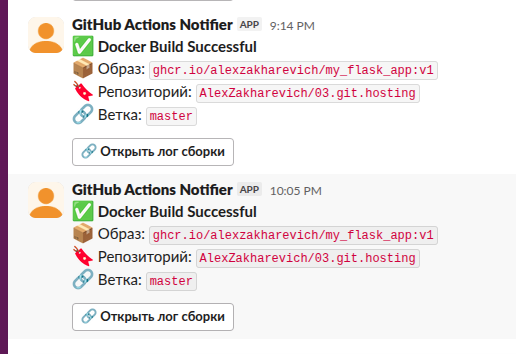

# 08.Docker.Docker compose

### Homework Assignment 1: Docker Compose for Application Stacks
#### Структура
- `docker-compose.yaml` – оркестрация сервисов
- `app.py` – исходный код Flask
- `Dockerfile` - для создания образа с app.py
- Именованный том `pgdata` хранит данные PostgreSQL
- Сеть `appnet` изолирует стек от других контейнеров

#### Запуск
docker compose up -d --build
Открыть: curl localhost:5050
Вывод: {"db_version":"PostgreSQL 15.18 on x86_64-pc-linux-musl, compiled by gcc (Alpine 15.2.0) 15.2.0, 64-bit","status":"ok"}

### Homework Assignment 2: Docker build automation (github action)
#### Структура
- `app.py` - исходный код приложения
- `Dockerfile` - многоступенчатый Dockerfile (builder → runtime)
- `requirements.txt` - зависимости Python
- `Docker_build.yml` - GitHub Actions workflow файл

#### Уведомление в Slack
Уведомления в Slack настроено через App GitHub Actions Notifier. Использовались Bot_TOKEN и CHANNEL_ID.
