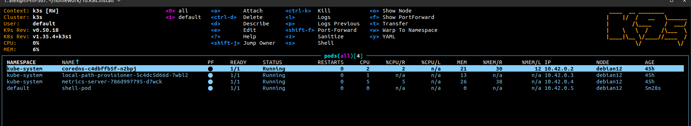

# 10.K8s.Install

### Make print-screen of k9s with pods in all namespaces


### Deploy shell pod in default namespace which you can you use for internal checks inside the cluster

```bash
apiVersion: v1
kind: Pod
metadata:
  name: shell-pod
  namespace: default
spec:
  containers:
  - name: shell
    image: alpine
    command: ["/bin/sh"]
    args: ["-c", "sleep 3600"]
```
kubectl apply -f shell-pod.yaml

kubectl get pods -A
```bash
NAMESPACE     NAME                                      READY   STATUS    RESTARTS   AGE
default       shell-pod                                 1/1     Running   0          27s
kube-system   coredns-c4dbffb5f-n2bpj                   1/1     Running   0          45h
kube-system   local-path-provisioner-5c4dc5d66d-7wbl2   1/1     Running   0          45h
kube-system   metrics-server-786d997795-d7wck           1/1     Running   0          45h
```

### Create GitHub action to check status of pods and create notification

#### Setup and run runner
```bash
mkdir ~/actions-runner && cd ~/actions-runner
curl -o actions-runner-linux-x64-latest.tar.gz -L https://github.com/actions/runner/releases/download/v2.322.0/actions-runner-linux-x64-2.322.0.tar.gz
tar xzf actions-runner-linux-x64-latest.tar.gz
./config.sh --url https://github.com/ВАШ_ЛОГИН/ВАШ_РЕПОЗИТОРИЙ --token ВАШ_PAT_ТОКЕН
./run.sh
```

`check-cluster.yml` - workflow автоматически мониторит Kubernetes кластеры и отправляет отчёт в Slack каждый час.